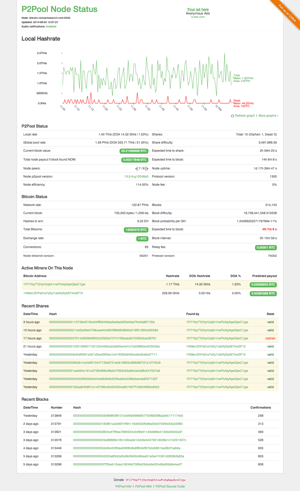

p2pool-node-status
==================

A clean p2pool node dashboard. It provides:

* Audio and text notifications for new shares and blocks (on most modern browsers)
* Detailed information about each share, block and transaction
* All the graphs you know and love

### Screenshot



### [Full demo here](http://bitcoin.ramosresearch.com)

## Note

This dashboard requires the use of a custom p2pool fork (https://github.com/jramos/p2pool). The fork adds additional web interfaces for retrieving block and transaction information.

## Installation

Do this in the top directory of your p2pool installation:

``` Bash
git clone https://github.com/jramos/p2pool-node-status.git web-static
```

and access via `http://<url-to-your-p2pool>:<port>/static`

## Configuration

The `config.json` is found in `js` directory.

### Highlight your own miner address

If you want your miner address highlighted, adjust `myself` variable accordingly. E. g.

``` JavaScript
var config = {
  myself : [
    "***REMOVED***"
  ],
  node_name : '',
  reload_interval : 30,
  reload_chart_interval : 600,
  enable_audio : true,
  header_url : '',
  footer_url : ''
}
```

### Customize the node name

By default. no node name is displayed. To customize, set `node_name` equal to the value you want to display. Note that this does not affect the host setting in any way.

``` JavaScript
var config = {
  myself : [],
  node_name : 'bitcoin.ramosresearch.com:9332',
  reload_interval : 30,
  reload_chart_interval : 600,
  enable_audio : true,
  header_url : '',
  footer_url : ''
}
```

### Adjust the reload intervals

Per default the UI updates the miner list and server stats every 30 seconds.  You can adjust the `reload_interval` variable like

``` JavaScript
var config = {
  myself : [],
  node_name : '',
  reload_interval : 20,
  reload_chart_interval : 1200,
  enable_audio : true,
  header_url : '',
  footer_url : ''
}
```

to set it to 20 seconds for example.

`reload_chart_interval` sets the amount of seconds until the hashrate graph is reloaded.  In above example, it's configured to 1200 seconds (20 minutes).

**Beware** that each API query puts network and CPU load on your p2pool installation.  Avoid decreasing this value too much.  In my tests, 20 to 30 seconds seem to be fair enough.

### Disable audio notifications

By default, audio is played when new shares or blocks are discovered. This can be disabled via the `enable_audio` configuration option. Set it to false if you don't want to hear audio notifications.

``` JavaScript
var config = {
  myself : [],
  node_name : '',
  reload_interval : 30,
  reload_chart_interval : 600,
  enable_audio : false,
  header_url : '',
  footer_url : ''
}
```

### Display a header and/or footer

Add HTML to the files references by the `header_url` and/or `footer_url` configuration settings to display an HTML snippet at the top and/or bottom of each page. Leave blank to disable.

``` JavaScript
var config = {
  myself : [],
  node_name : '',
  reload_interval : 30,
  reload_chart_interval : 600,
  enable_audio : true,
  header_url : 'header.html',
  footer_url : 'footer.html'
}
```

## Donate

If you like this tool, find it useful or if you just find it useful, that people out there writing free software for everybody to use or contribute, please donate some bitcoins:

* Alexander Zschach, `1MzFr1eKzLEC1tuoZ7URMB7WWBMgHKimKe`
* Justin Ramos, `***REMOVED***`

## License

Code released under [the MIT license](LICENSE.txt).
